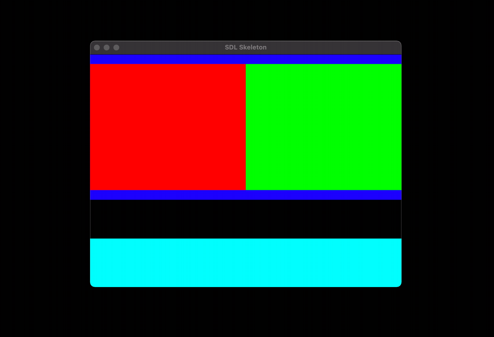

# Installation

```sh
$ nimble install https://github.com/farism/flex.git
```

# Introduction

This repository contains Nim bindings for the [Xamarin/Flex](https://github.com/xamarin/flex) C library. It is statically linked for easily portability.

The styling API follows the Flexbox CSS API, and is meant to serve as the base building blocks for more complex widgets.

# Usage

```nim
var 
  root = newFlexItem(640, 480, direction = Column, justifyContent = SpaceBetween)        # black
  topRow = newFlexItem(0, 300, direction = Row, paddingTop = 20, paddingBottom = 20)     # blue
  bottomRow = newFlexItem(0, 100, direction = Row)                                       # teal
  leftChild = newFlexItem(0, 0, grow = 1)                                                # red
  rightChild = newFlexItem(0, 0, grow = 1)                                               # green

topRow.add(leftChild)
topRow.add(rightChild)
root.add(topRow)
root.add(bottomRow)
root.layout()
```

Please view the [documentation](https://farism.github.io/flex/) for more information.

# Examples



Please see the [SDL2 example](examples/sdl.nim) for a flexbox layout demo. 

You can run the example with `nimble sdl`.